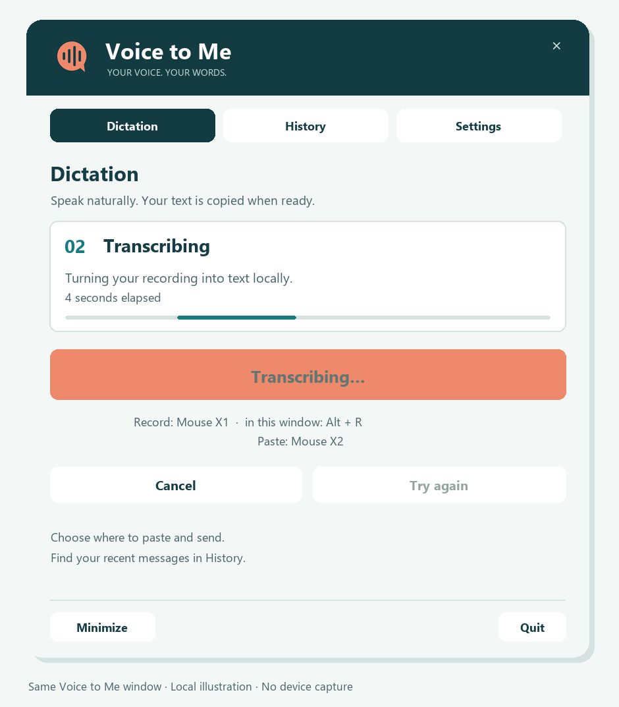
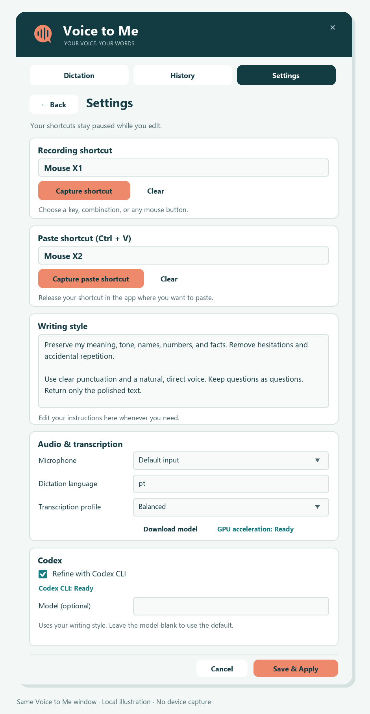
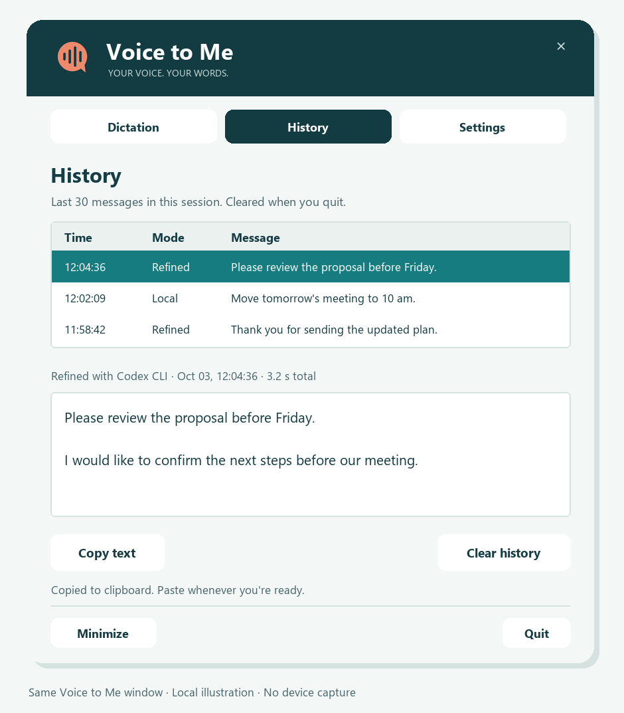

# Voice to Me

[](https://github.com/viamus/voice-to-me/actions/workflows/ci.yml)

**Speak naturally. Turn your voice into a message. Paste it with one button.**

Voice to Me is a Windows dictation app with local Whisper transcription, optional text refinement through **OpenAI Codex CLI**, and separate keyboard or mouse shortcuts for recording and pasting.

## Why I built it

I built this project after breaking my arm, to make it easier to write messages in Microsoft Teams using my voice. Everyday typing became slow and frustrating. I wanted a simple way to speak a message, clean up the wording in my own style, and paste it without needing two hands.

The workflow uses two controls: one button starts and stops recording; another pastes the finished message. You choose the destination and when to send it.



The previews are local design illustrations, not screenshots or captured conversations. The app interface and documentation are in English.

## What it does

- Records with a single press to start and another to stop.
- Transcribes locally with Whisper and automatically uses a compatible NVIDIA GPU.
- Uses **Codex CLI under the hood** to improve punctuation, remove hesitation and follow your writing style.
- Copies the result to the clipboard and offers a separate, optional **Ctrl + V** macro.
- Confirms recording start, recording stop and completion with short sounds.
- Shows processing stages, elapsed time and Windows tray notifications.
- Keeps shortcuts, writing style, transcription and Codex options in the same built-in Settings page.
- Keeps the last 30 completed messages in session history, with a full preview and a button to copy again.

## Codex CLI is required for text refinement

Voice to Me does not replace or install Codex CLI. **Install and sign in to Codex CLI before enabling refinement.** The app invokes its native `exec` command in the background to rewrite the transcription using your style instructions. See the [official Codex CLI installation guide](https://developers.openai.com/codex/cli/).

If Codex CLI is missing, incompatible or not signed in, open **Settings → Codex** and leave **Refine with Codex CLI** off. The app checks readiness and makes unavailable refinement disabled in the editor. Click **Save & Apply** to use local transcription directly.

| Mode | Requirement | Result |
| --- | --- | --- |
| Refine with Codex CLI on | Installed, compatible, authenticated Codex CLI and network access | Text polished in your writing style |
| Refine with Codex CLI off | Local Whisper model | Direct local transcription; no Codex call |

## Install and use

You need **Windows**, **Python 3.12 with Tcl/Tk**, and a microphone. Install Codex CLI if you want text refinement. `uv` is recommended; setup also supports the Windows Python launcher and pip.

In PowerShell:

```powershell
git clone https://github.com/viamus/voice-to-me.git
cd voice-to-me
.\setup.bat
.\run.bat
```

Open **Settings**, choose your microphone and transcription profile, and click **Download model** if the model is not cached yet. Setup installs the project's GPU dependencies when NVIDIA hardware is detected. Model downloads are an explicit action.

1. Press the recording shortcut or **Start recording**.
2. Speak, then press the same shortcut or **Finish recording**.
3. Wait for the completion chime and **Copied to clipboard**.
4. Focus the destination text field and use your paste shortcut or **Ctrl + V**.

The default recording shortcut is **Ctrl + Alt + Space**. A useful mouse setup is **X1 to record/stop** and **X2 to paste**, captured separately in Settings. The paste macro runs when its button or key combination is released. It does not send the message.

## Personalize it

**Settings** replaces the main page inside the same window. Capture a keyboard shortcut or mouse button for each action, edit your writing style, select **Fast**, **Balanced** or **Best quality** transcription, and enable or disable Codex refinement. **Save & Apply** activates changes immediately. **Back/Cancel** discard edits.

Recording and paste shortcuts are paused while editing. The app rejects conflicting bindings.

**X** and **Minimize** hide the window to the Windows tray when the tray icon is ready. Recording, processing, configured shortcuts and session history remain active. Choose **Open Voice to Me** in the tray menu to bring the window back. If the tray is unavailable or still starting, the window minimizes to the taskbar so you can still reach it.

If Settings is open, X/Minimize discard unsaved edits like **Back/Cancel** and resume the configured shortcuts.

Choose **Quit** in the window or tray menu to exit, remove the tray icon, release resources and clear session history, including during processing.



## Find a previous message

Use **History** in the window or tray menu to review the last 30 completed messages from this session. Select a message to see its full text, completion time, duration and whether Codex refined it. **Copy text** puts it back on the clipboard; use your separate paste shortcut when ready. **Clear history** removes the list.

History stays in memory and is cleared when you quit. It does not save conversations to disk. Failed or cancelled attempts do not enter the list.



## Your data

Audio and session history stay in memory on your computer. With refinement enabled, only the transcription and writing style are passed to Codex CLI. With refinement disabled, transcription stays local. Logs exclude dictated text and style instructions. Clipboard output is under your control.

## Documentation

- [Getting started and controls](docs/getting-started.md)
- [How it works and data handling](docs/architecture.md)
- [Troubleshooting](docs/troubleshooting.md)
- [Validation and hardware test boundaries](VALIDATION.md)
- [Version history](CHANGELOG.md)

## Development

```powershell
uv sync --locked --extra dev --python 3.12
.\.venv\Scripts\python.exe -m pytest -q
.\.venv\Scripts\python.exe -m ruff check src tests scripts
uv build --wheel
.\.venv\Scripts\python.exe scripts/check_wheel.py
```

GitHub Actions runs the tests, lint and package checks on Windows with Python 3.12. Tests use simulated devices and input; running them does not record your voice, paste into another application or request a remote refinement.

## Contributing and community

- [Contributing guide](CONTRIBUTING.md)
- [Code of Conduct](CODE_OF_CONDUCT.md)
- [Bug reports and feature requests](https://github.com/viamus/voice-to-me/issues/new/choose)
- [Security policy and private vulnerability reporting](SECURITY.md)

## License

Voice to Me is available under the [MIT license](LICENSE). Keep the copyright and license notice when redistributing the software or substantial portions of it.

Dependencies, downloaded speech models and Codex CLI retain their own licenses and terms.
